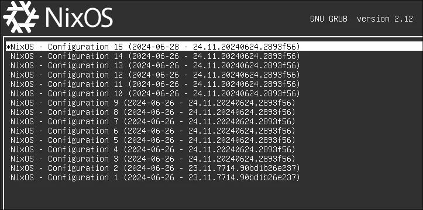
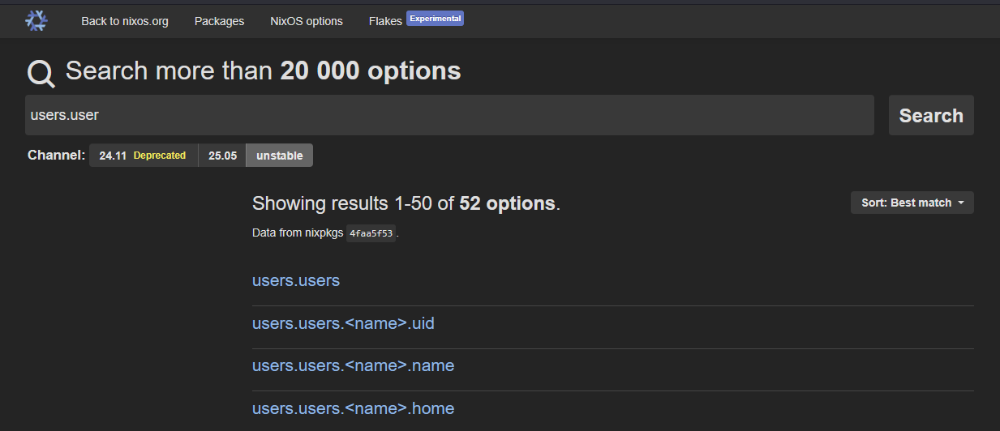
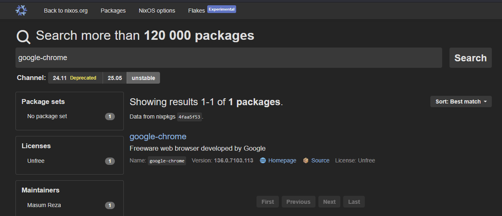
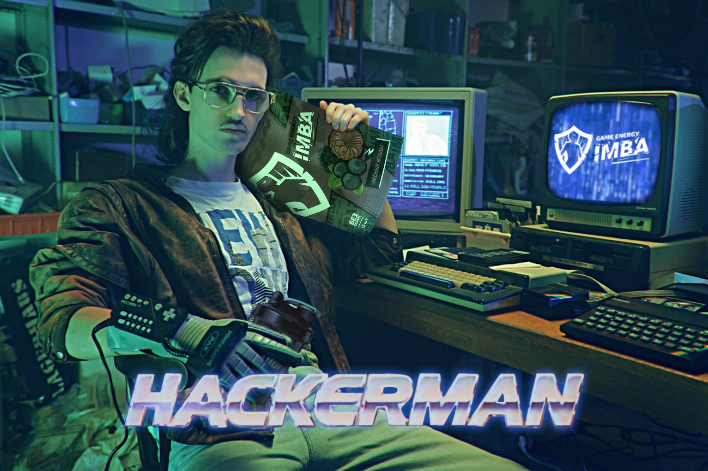

---
# You can also start simply with 'default'
theme: default
# random image from a curated Unsplash collection by Anthony
# like them? see https://unsplash.com/collections/94734566/slidev
background: ./bg.jpg
# some information about your slides (markdown enabled)
title: Setup
# apply unocss classes to the current slide
class: text-center
# https://sli.dev/features/drawing
drawings:
  persist: false
# slide transition: https://sli.dev/guide/animations.html#slide-transitions
transition: slide-left
# enable MDC Syntax: https://sli.dev/features/mdc
mdc: true
---

# Сетап

> О том, как создать ультимативную рабочую станцию.

---

# Какие задачи должна решать рабочая станция веб-разработчика?

<v-clicks>

- работа непосредственно с веб-проектами (NodeJS и его зависимости)
- наличие разных браузеров (Chrome, Firefox, Safari и т.д.)
- редакторы кода (VS Code, WebStorm, NeoVim и т.д.)
- Docker-контейнеры и менеджмент сети.

</v-clicks>

<v-clicks>

Большинство инструментов сегодня являются кросс-платформенными.

Однако, какую систему выбрать в качестве основы? Рассмотрим варианты.

</v-clicks>

<!-- 2 min -->
<!-- Сперва, давайте разберёмся в том, ... -->
---

## Linux

➕ Плюсы:

<v-clicks>

- высокая стабильность (а это важно для **рабочей** машины)
- нативный Docker (ест меньше ресурсов, чем Docker Desktop)
- рабочая среда, близкая к раннерам сборщиков

</v-clicks>

➖ Минусы:

<v-clicks>

- доступен далеко не весь софт
- довольно неряшливый интерфейс
- сложности в настройке

</v-clicks>

<!-- 3 min -->
<!-- например, той же Figma нет в виде приложения -->
<!-- я, как дизайнер интерфейсов в прошлом... -->
---

## Windows

➕ Плюсы:

<v-clicks>

- доступен почти весь софт
- достаточно приятный и привычный интерфейс

</v-clicks>

➖ Минусы:

<v-clicks>

- низкая стабильность работы, обновления
- сложности при настройке и работе софта
- ненативный Docker Desktop, прослойки в виде WSL

</v-clicks>

<!-- 3 min -->
---

## macOS

➕ Плюсы:

<v-clicks>

- UNIX-like среда, близкая к Linux
- изящный и продуманный интерфейс
- доступно большинство софта
- высокая стабильность

</v-clicks>

➖ Минусы:

<v-clicks>

- обычно идёт вместе со своим железом
- ненативный Docker Desktop

</v-clicks>

<!-- 3 min -->
---

# Зачем нужна универсальность?

<v-clicks>

В идеале, хотелось бы взять все плюсы от macOS или Windows и совместить их с Linux.

Допустим, прилетает баг отображения на Safari, а у нас только винда. Что делать?

Или, у кого-то из коллег есть проблемы с проектом, а у них Linux. Отправляем в поддержку?

Нужно иметь по одному девайсу для системы или можно «усидеть сразу на всех стульях»?

</v-clicks>

<v-click>
Ответ: Да, можно! С помощью <b>виртуализации</b>.

Виртуализация поможет запустить нам сразу две (или более) системы на одном компьютере и делегировать обязанности между ними.
</v-click>

<v-click>
Существует несколько систем виртуализации: VMWare, VirtualBOX, QEMU KVM и т.д.
</v-click>

<v-clicks>

- VMWare: мощная, корпоративная, платная
- VirtualBox: средняя по фичам, простая в настройке, open-source
- QEMU: самая продвинутая, сложная в настройке, open-source

</v-clicks>

<!-- 1.5 min + 1.5 min -->
<!-- Конечно, здесь придётся сделать выбор, взвешивая плюсы и минусы. -->
<!-- Я взял за основу именно QEMU, потому что она позволяет нативно пробросить железо в виртуальную систему. То есть, к примеру, моя видеокарта или SSD будут работать с виртуальной системой **напрямую**, с производительностью, близкой к нативной. -->
---

# Железо

Какое железо необходимо, чтобы чувствовать себя хорошо,<br>имея при этом две одновременно работающих системы,<br>да ещё и запускать рабочие проекты, тесты и т.д.?

<v-click>
Я пришёл к следующей конфигурации:

- `CPU` Intel Core i5-13600K (6P+4E)
- `GPU` NVidia RTX 3080 (10 GB)
- `RAM` Ballistix DDR4 (32 GB)
- `SSD` AData 960 MAX (2 TB)
- И остальное, по мелочи...

</v-click>

<v-click>
Стоит отметить, что в современном ПК самой важной частью, которая даёт наибольший прирост производительности, является SSD. В моём случае, это NVMe SSD со скоростями 7400/6800 MB/s.
</v-click>

<!-- 4.5 min -->
<!-- Окей, я выбрал для себя связку Linux (Host) + Windows (VM). Но на чём запускать всё это? -->
---

Чтобы воспользоваться QEMU, хост-системой желательно выбрать Linux. Но какой?

<v-click>
Ubuntu? Linux Mint? Arch Linux? Что будет лучше?
</v-click>

<br>
<br>

<v-click>
Дистрибутивов Linux существует просто великое множество.<br>
Самым популярным у нас вариантом является Ubuntu.<br>
Но, не всё так просто.
</v-click>

<br>
<br>

<v-click>
Говорят, если ты поставишь себе Linux, то ты сможешь всё настроить.<br>Проблема заключается в том, что ты *должен* будешь всё настроить.
</v-click>

<!-- 0.5 min -->
<!-- Помните, я упоминал сложность конфигурации? -->
---

# А что, собственно настраивать?

<v-clicks>

- саму систему (начиная от времени и даты, заканчивая обоями и VPN)
- установить весь нужный софт, используя пакетный менеджер
- настроить весь этот софт (порты, разрешения и т.п.)
- настроить рабочее окружение (Shell, Git, Инструментарий)
- и ещё много чего...

</v-clicks>

<!-- 1.5 min -->
---

# А что, если система превратится в тыкву?

Ошибки случаются и в какой-то момент вся ваша система может сломаться.

<v-clicks>

Ладно, если её можно будет починить/откатить... А если откажет SSD?

Всё, что я перечислил раньше — придётся делать заново.


Или делать бэкапы. Но, будем честны, кто всем этим занимается?

</v-clicks>

<!-- 1.5 min -->
<!-- Конечно, можно написать скрипт автоматизации через какой-нибудь Ansible и вручную забивать все команды, которые вы делали за пару-тройку недель использования и настройки... -->
---

# На сцену, выходит Nix(OS)

Что это?

<v-clicks>

- Язык `Nix` для описания сборки и конфигурации пакетов.
- Внутри одного пакета можно использовать другие пакеты.
- А что, если собрать из «пакетов» целую систему?
- Так получилась `NixOS`

</v-clicks>

---

<v-clicks>

- Дистрибутив Linux, основанный целиком и полностью на пакетном менеджере `Nix`.

<br/>

- В корне всего процесса лежат конфигурационные файлы на языке `Nix`<br>которые после обработки выдают вам новую сборку (generation) системы.

<br/>

- Можно свободно переключаться между этими Generation'ами, ничего не сломается.<br>Конфигурация либо соберётся правильно, либо не соберётся вообще.

</v-clicks>

<v-click>



</v-click>

<!-- 1.5 min -->
---

# Как выглядит конфигурация?

На примере конфигурации Git

```nix {all|2-3|5-6|8-12|all}
  programs.git = {
  	enable = true;
  	package = pgks.gitFull;

  	userName = "Nikita Shirokov";
  	userEmail = "braindefender@gmail.com";

  	extraConfig = {
  	  init.defaultBranch = "master";
  	  push.autoSetupRemote = true;
  	  pull.rebase = true;
  	};
  };
```

<!-- 1 min -->
---

Или вот, пример конфига системы:

```nix {all|1-2|4|6|8-11|all}
  # Включает OpenSSH сервер
  services.openssh.enable = true;

  networking.networkmanager.enable = true;

  time.timeZone = "Asia/Novosibirsk";

  # Устанавливает GNOME в качестве рабочей среды
  services.xserver.displayManager.gdm.enable = true;
  services.xserver.desktopManager.gnome.enable = true;
```

Все эти опции достаточно хорошо описаны в `Nix Options`.

<v-click>



</v-click>

<!-- 1.5 min -->
---

# А как установить пакеты?

Очень просто:

```nix
  environment.systemPackages = with pkgs; [
    vim
    firefox
    nodejs
    docker-compose
    ...
  ];
```

Описания всех доступных пакетов лежат в Nix Packages.

<v-click>



</v-click>

<!-- 0.5 min -->
---

# Как это развернуть?

```bash
  # Запустит сборку новой конфигурации и переключится на неё
  sudo nixos-rebuild switch
```
<br>
<br>

<v-click>

<h1>Что это нам даёт?</h1>

</v-click>

<v-clicks>

- Один или несколько конфигурационных файлов, которые превращаются в целую систему.

- Эти файлы можно закинуть в Git-репозиторий и установить систему напрямую из него.

- Полная репродуцируемость — одинаковый конфиг на двух разных машинах даст вам *идентичный* результат.

</v-clicks>

<!-- 3 min -->
---

# А что с обычными файлами?


Можно ли иметь Git для всей файловой системы сразу?

<v-clicks>
Да, можно! И здесь добавляется следующий ингридиент — ZFS.

Это корпоративная файловая система, разработанная Sun Microsystems. Обычно, она используется крутыми дядьками на крутых серверах, где много дисков, много данных, и надо как-то с этим работать.


</v-clicks>

<!-- Окей, мы решили проблему воспроизводимости системы. -->

<!-- 0.5 min -->
---

# Из чего состоит ZFS?

<v-click>

### Пулы
Pool — это верхнеуровневая структура, позволяющая объединить в себя устройства хранения данных.

> Например, можно объединить несколько жёстких дисков в одно виртуальное устройство

```bash
zpool create [name] raidz [device1] [device2] ...
```

</v-click>

<br>

<v-click>

### Датасеты
Dataset — это разделы ZFS, без фиксированного размера — они растут вместе со своим контентом.

> Для отдельных датасетов можно указывать свои настройки

```bash
zfs create [pool]/[dataset]
```

</v-click>

---

# Что предоставляет ZFS

<v-clicks>

- Механизм Copy-On-Write (COW). Умная стратегия, которая откладывает создание полной копии данных до тех пор, пока эти данные не потребуется изменить.

- Механизм Snapshot'ов, основанный на COW. В любое время, вы можете создать snapshot состояния файловой системы, а затем, если понадобится, откатить его к этому состоянию.

- Сжатие данных, чтобы они буквально весили меньше, как `ZIP` или `RAR` архивы.

- Дедупликация. Когда одинаковые блоки файлов, проверяются по хэшу и вместо копирования блока происходит копирование только ссылки на этот блок.

</v-clicks>

<!-- 2.5 min -->
---

# Для чего мне нужен ZFS?

<v-clicks>

Чтобы установить __виртуальную__ систему, мне понадобится выделить __виртуальный__ диск.

Я могу расположить его в отдельном датасете ZFS и сразу же после установки Windows сделать `snapshot` (снимок). Таким образом, у меня будет возможность «переустановить винду» за секунды!

```bash
# Создаёт снапшот датасета
zfs snapshot [dataset]@[snapshot-name]

# Откатывает состояние датасета к снапшоту
zfs rollback [dataset]@[snapshot-name]
```

А ещё, я могу настроить итеративные снимки датасета со своими проектами, получая своеобразный архив данных, к которому, в случае чего, всегда можно вернуться.

> Снимки позволяют заходить в себя как в папки

</v-clicks>

<!-- 2 min -->
---

# Но как с этим работать?

Ладно, с основными ингридиентами разобрались.<br>Поставили винду в виртуалку, всё настроили, сохранили. Красота.

<v-clicks>

- нужно иметь возможность как-то подключаться к Linux из Windows

- запускать проект в Linux так, чтобы он был доступен в Windows

- иметь возможность работать с файлами из любой системы.

</v-clicks>

<!-- 0.5 min, (создавать, копировать, перемещать) -->
---

# SSH

Через него мы будем подключаться из Windows в Linux.

<v-clicks>

Для популярных редакторов кода есть расширения,<br>позволяющие работать с проектом по SSH.
> В VS Code оно и вовсе встроено с какого-то момента.

Также, расширение для VS Code забирает на себя<br>проброс портов между хостом и виртуальной машиной.

> Поэтому, проект развёрнутый на `localhost:3000` в хосте, будет доступен по тому же адресу в VM.

А ещё, можно настроить Bridge — когда и у хоста, и у виртуалки будут отдельные IP'шники на роутере.

</v-clicks>

<!-- 1 min -->
---

# Samba

И это не только аргентинский танец, но ещё и пакет программ для работы с сетевыми дисками.

В Linux мы поднимем Samba-сервер, а в Windows просто подключимся к нему.

```nix {all|2-3|4-11|12-20|all}
  services.samba = {
  	enable = true;
  	openFirewall = true;
  	settings.global = {
      "workgroup" = "WORKGROUP";
      "server string" = "nixsmb";
      "netbios name" = "nixsmb";
      "security" = "user";
      "hosts allow" = "192.168.0. 127.0.0.1 localhost";
      "hosts deny" = "0.0.0.0/0";
    };
    settings.private = {
      "path" = "/nexus";
      "browsable" = "yes";
      "read only" = "no";
      "create mask" = "0644";
      "directory mask" = "0755";
      "force user" = "brain";
      "force group" = "users";
    };
  };

  services.samba-wsdd = {
    enable = true;
    openFirewall = true;
  };
```

<!-- 1 min -->
---

# В заключение

Небольшие бонусы, которые даёт эта система:

<v-click>

## Масштабируемость.

К примеру, вы всё таки решили купить себе MacBook или ноутбук на Windows. Текущий сетап позволяет встроить его в систему точно также, как виртуальную машину с Windows. Можно подключаться к хосту через тот же SSH, можно перекидывать файлы через Samba.

</v-click>

<v-click>

## Стабильность.

Git-репозиторий для конфигурации системы и ZFS снапшоты для файловой системы позволяют гораздо меньше париться о потенциальной потере данных. Конечно, чтобы совсем избавиться от подобных проблем, надо делать бэкапы на какое-нибудь внешнее устройство или сервер<br>(но это уже за рамками этой презентации)

</v-click>

<!-- 1 min -->
---

# В заключение

Небольшие бонусы, которые даёт эта система:

## Универсальность.

Наличие сразу нескольких систем позволяет быстро переключиться на нужную, чтобы что-то задебажить. Например, проверить отображение сайта не только в разных браузерах, но и разных системах. Или выявить какие-либо системо-зависимые проблемы в проекте.

<!-- Поэтому, когда ко мне пришли наши сисадмины и спросили какая у меня ОС, мой ответ их удивил -->
---


<v-click>

# В следующих сериях...

- Workflow работы на macOS: приложения, утилиты, конфигурации.
- Устройства ввода: мыши, трекболы, клавиатуры и раскладки.

</v-click>

---

# Бонус

А можно ли играть на таком «сервере»?

<v-clicks>

Да, можно! QEMU позволяет пробросить железо в виртуальную систему нативно

- Говорим Linux'у «забудь про видеокарту», даём доступ к GPU виртуалке

- Получаем около-нативный performance (ценой ~5% FPS из-за упора в vCPU)



</v-clicks>

---

# Бонус. macOS

Покупать MacBook дорого. Можно ли накатить виртуальный Хакинтош?

<v-clicks>

- Говорим Linux'у «теперь забудь и про видеокарту на процессоре»

- Получаем headless-linux и две параллельно работающие ОС


</v-clicks>

<!-- Потому что macOS и NVidia, к сожалению не дружат. -->
